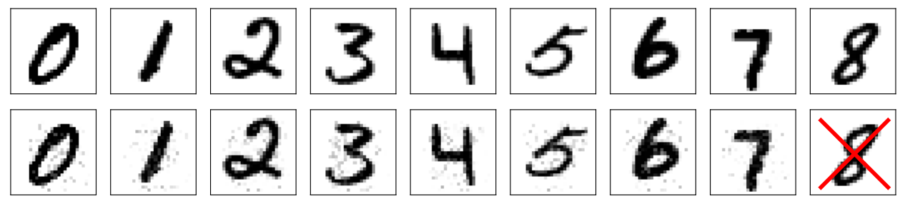
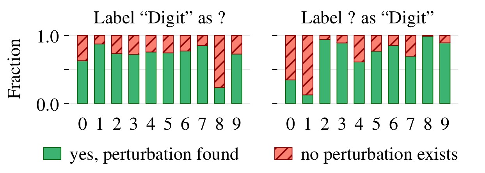
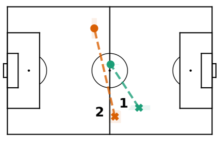

# :ballot_box_with_check: treeck: reasoning about potential instances of additive tree ensembles

Treeck (**tree** che**ck**) is a system that allows you to ask *general questions* about an additive tree ensemble. Popular additive tree ensembles are boosted trees (e.g., [XGBoost](https://xgboost.readthedocs.io/en/latest/), [LightGBM](https://lightgbm.readthedocs.io/en/latest/)), and random forests.

Typical examples of such *general questions* are:

 - Can we slightly perturb an instance from the dataset such that the predicted label changes? Such perturbations are also called **adversarial examples**.
 - Can we find values for the unknown attributes of a partially described instance such that a certain label is predicted?


## Use cases

What follows are some interesting examples of questions you can ask your models.

### MNIST adversarial examples

The [MNIST](http://yann.lecun.com/exdb/mnist/) dataset contains 28×28 images of handwritten digits. The task is to predict the digit in the image. We can ask the following question:

> Given a correctly classified instance `x` with label `l` from the dataset, can we find a modified instance `x'` such that `|x'_k - x_k| < delta` and `sum_k |x'_k - x_k| < Delta` for which the predicted label is `l' != l`?

The answer is usually **yes**, which means that the model in question is not robust, i.e., it can easily be fooled (for that specific instance). Some examples for `delta = 75` and `Delta = 3000` are shown below. All digits except for digit eight in the bottom row are classified as *nine*. For the last *eight*, treeck proved that it is not possible to perturb the instance such that it is classifier as a *nine* given the `delta` and `Delta`.



In the above example,  It is also possible to investigate *average robustness* by asking the above question for many instances in the dataset. We can then count how often we can fool the classifier.



The left side shows how difficult it is to change the label of each digit. The right side shows how difficult it is to perturb an instance such that the model predicts a specific target digit. We can see that it is hard to change an *eight* into another digit, but it is easy to change any other digit into an *eight*. The opposite is true for the *one* digit, which is easy to change into any other digit, but it is hard to turn another digit into a *one*.

### YouTube: predicting *log10(views)*

We use a bag-of-words dataset constructed from [trending YouTube videos](https://www.kaggle.com/datasnaek/youtube-new), and predict the `log10` of the view count based on the words in the title and the description. The model has a mean absolute error of 0.38 on the test set, so it is able to predict order of magnitudes.

We ask the following question:

> Is it possible to find a single word that, when added to the title, increases the predicted view count by two orders of magnitude?

The system is indeed able to find such examples. For the first example, we constrained the title to contain the words "night", "talk", and "show":

> Late **night talk show video: pop drama** about the **latest hot Christmas house album** (***remix***).

Adding the word ***remix*** changes the predicted number of views from 200,000 to 30,000,000.

We forced the following example to contain the words "news", "breaking", and "channel":

> **Breaking news** from the **money channel**: ***no*** **weird vlogs today challenge** (**full movie**).

Without ***no***, the video is predicted to get 100,000 views. With ***no***, this number grows to 100,000,000.

In this last example, we asked the opposite question: "can we find a word that, when omitted, increases the view count?" We did not force the title to contain any particular words:

> **The 12 avengers challenge Paul**, the ***Christmas*** **pop fashion king** in **DE**.

Omitting ***Christmas*** changes the predicted view count from 1000 views to 1,000,000 views.

These examples clearly indicate one has to be careful when using similar models in sensitive, real-world applications (e.g. classifying insurance claims based on words in the client's submitted document). A single word can drastically change the predicted value in unexpected ways.

### Soccer: predicting goal probabilities

We use the [socceraction](https://github.com/ML-KULeuven/socceraction) package to construct a model, and we ask the following question:

> Can we find a two-sequence action involving a backward pass in the middle of the field that results in a >10% goal probability?

The model proved that our model cannot output pass-pass sequences with such high probability. It was able to find pass-dribble sequences, however (plot using [matplotsoccer](https://github.com/TomDecroos/matplotsoccer)). The pass starts at the position indicated with a cross, and end in the position indicated with a circle. The dribble starts at the circle.




## Illustrative code example

### Setting up [Dask](https://dask.org/)

We use Dask to distribute the work over a cluster of workers. Dask is easy to set up and can easily be used on a single machine as follows.

In one terminal, start a Dask scheduler:

```bash
dask-scheduler --host localhost
```

In another terminal, start a Dask worker:

```bash
dask-worker --nprocs 1 --nthreads 1 localhost:8786
```

We can *connect* to Dask from Python as follows:

```python
from dask.distributed import Client
with Client("locahost:8786") as dask_client:
    pass # do stuff with your Dask client
```

### Formulating the question

Treeck translates the model, the question, and any available background knowledge to SMT, a language for logical theories. The SMT is then passed to an SMT solver (we use [Z3](https://github.com/Z3Prover/z3)). The translation of the model is done automatically, but treeck needs help for the question and the optional background knowledge. Treeck needs a *recipe* for the question in the form of a `VerifierFactory`. The factory is used to instantiate `Verifier` objects with your question. An example:

```python
from treeck.verifier import Verifier
from treeck.z3backend import Z3Backend
from treeck.distributed import VerifierFactory

class MyVerifierFactory(VerifierFactory):
    def __init__(self): # you could pass any additional information you might need here
        pass            # for example: a particular MNIST instance
        
    def __call__(self, domain_info, is_prune_step):
        v = Verifier(domain_info, Z3Backend())
        
        # Question: "is it possible to have an output less than 120 when X0 is greater
        # than 10 and X1 is less than X2?"
        v.add_constraint(v.xvar(0) > 10.0) # attribute 1 must be bigger than 10.0
        v.add_constraint(v.xvar(1) < v.xvar(2)) # attribute 2 is less than attribute 3
        v.add_constraint(v.fvar() < 120) # the output of the model must be less than 120
        
        return v
```

### Starting the verification procedure

Once we have a factory for questions, we can start treeck.

```python
from treeck import DomTree
from treeck.xgb import addtree_from_xgb_model
from treeck.distributed import DistributedVerifier

addtree = addtree_from_xgb_model(xgb_model)
dv = DistributedVerifier(dask_client, DomTree(addtree, {}), MyVerifierFactory(),
                         **additional_kwarg_options)
dv.check()
print(dv.results) # contains results even when treeck is stopped prematurely
```

Treeck uses a prune, divide & conquer approach.


## Installing treeck

You can install treeck using [pip](https://pip.pypa.io/en/stable/reference/pip_install/#vcs-support):

```
pip install git+https://github.com/laudv/treeck.git
```

Parts of treeck are writtin in C++, so you need CMake, a C++ compiler, and the Python headers.

Ubuntu: `apt install cmake gcc python3-dev`

Fedora: `dnf install cmake gcc-c++ python3-devel`

If you want to verify models constructed by XGBoost, then you should also install it:

```
pip install xgboost
```

## Citing treeck

Please cite [the following paper](https://arxiv.org/abs/2001.11905) when you use this work:

```
@misc{devos2020additive,
    title={Additive Tree Ensembles: Reasoning About Potential Instances},
    author={Laurens Devos and Wannes Meert and Jesse Davis},
    year={2020},
    eprint={2001.11905},
    archivePrefix={arXiv},
    primaryClass={cs.LG}
}
```
